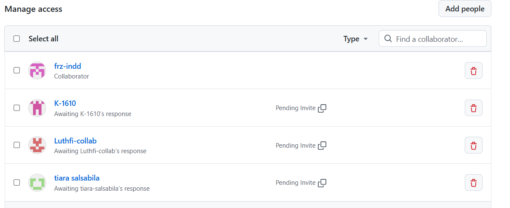

### Proses Pengembangan Project Lab Kelompokn 1

Anggota kelompok :

1. Adel Zamalya_2488010059
2. Mochamad Fariz Rahman Pratama_2488010083
3. Kamalul Iman_2488010054
4. Tiara Salsabila_2488010045
5. Luthfi Baihaqi_2488010036

# Progres Pengembangan 1 ( Pertemuan 5)

1.  Tugas Ketua Kelompok ( Adel Zamalya ) - Inisiasi project dan Invite anggota
    
    -Publish project ke github
        - Create Project (npx create-expo-app@latest)
    <video controls src="Recording-2026-10-01-100151.mp4" title="Title"></video>

Tiara Salsabila

Luthfi Baihaqi

Mohamad Faris Rachman Pratama

